### 2023-04-09 Gitee分支与实战

#### MySQL免安装使用

根目录 >  21智能> 下载解压mysql-8.0.32-winx64.zip

mysql-8.0.32-winx64\bin目录，cmd：mysqld.exe 回车后，不关闭窗口

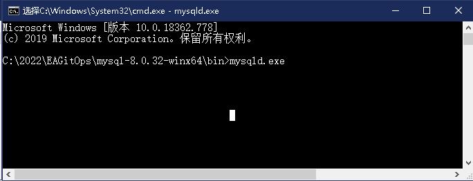

mysql-8.0.32-winx64\bin目录 再开窗，cmd：mysql.exe -uroot -pgitops123

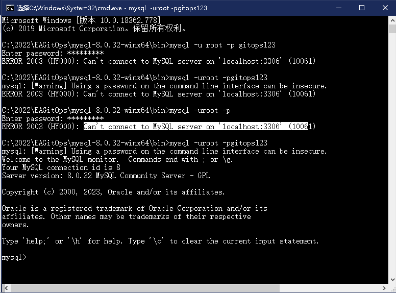

#### PyCharm操作

pycharm get from vcs

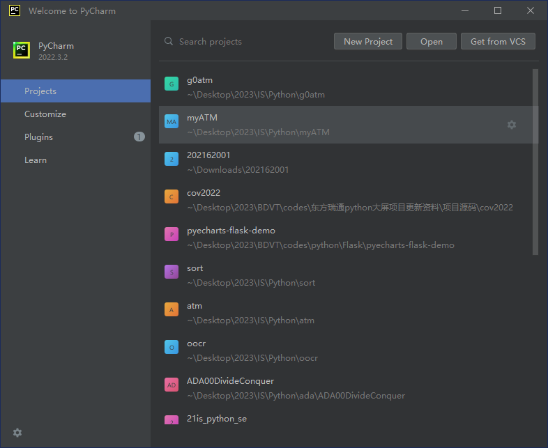

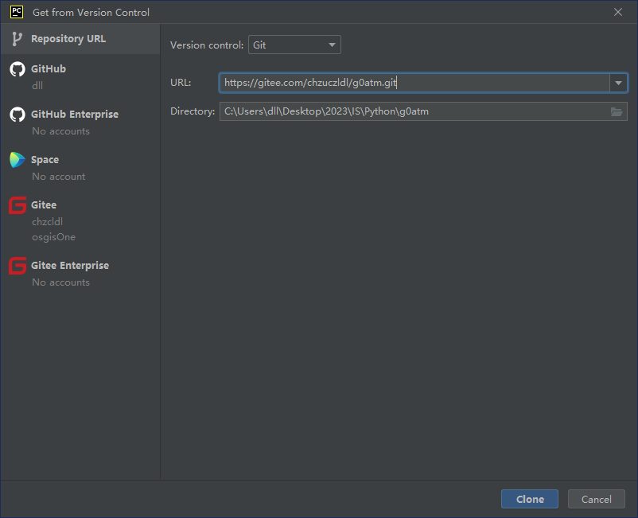

也可以选择Gitee直接打开Gitee仓库（以后演示）。

#### 开发Py：LoginATM-mysql.py

#### Git push失败及解决

pyCharm--file--setting--version control--gitee-->授权

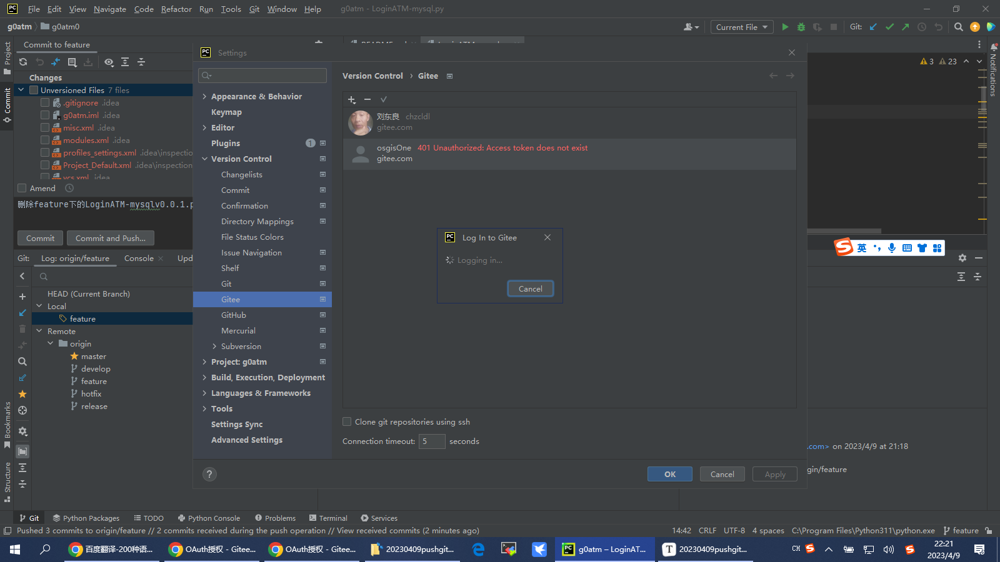

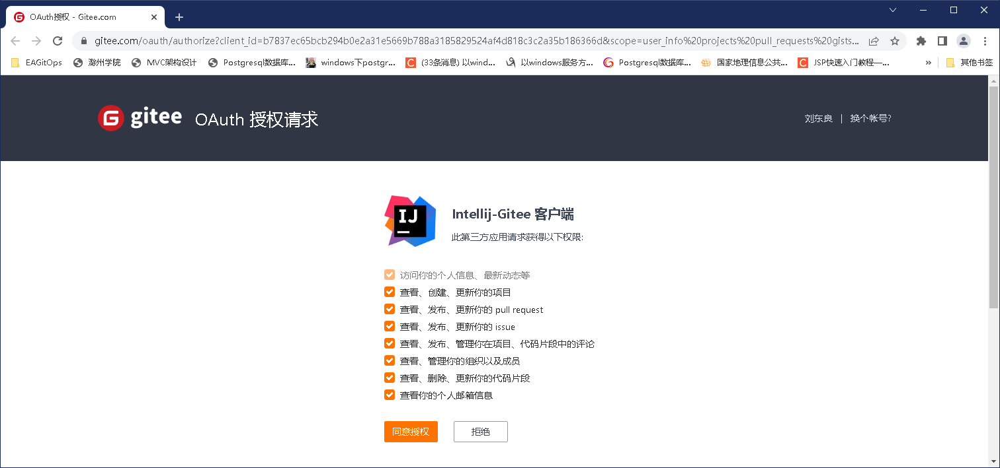

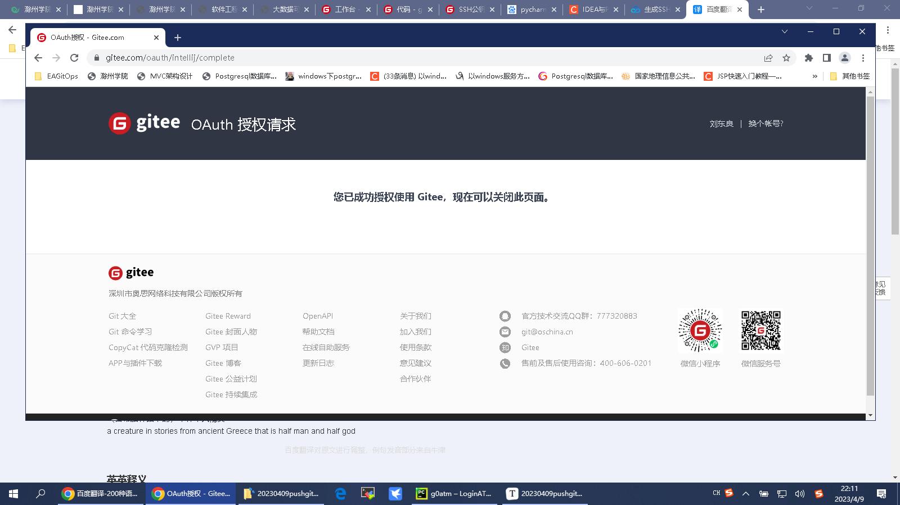

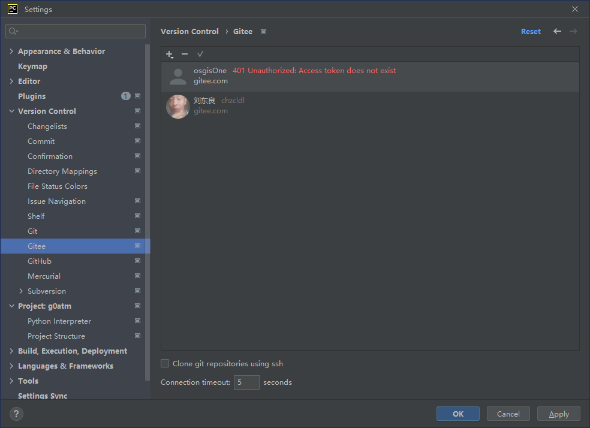

刘东良为gitee的企业账号，osgisOne为我的Gitee的个人命名空间，所以出错！

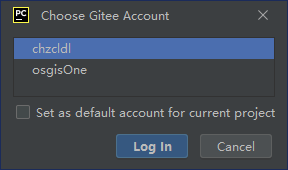

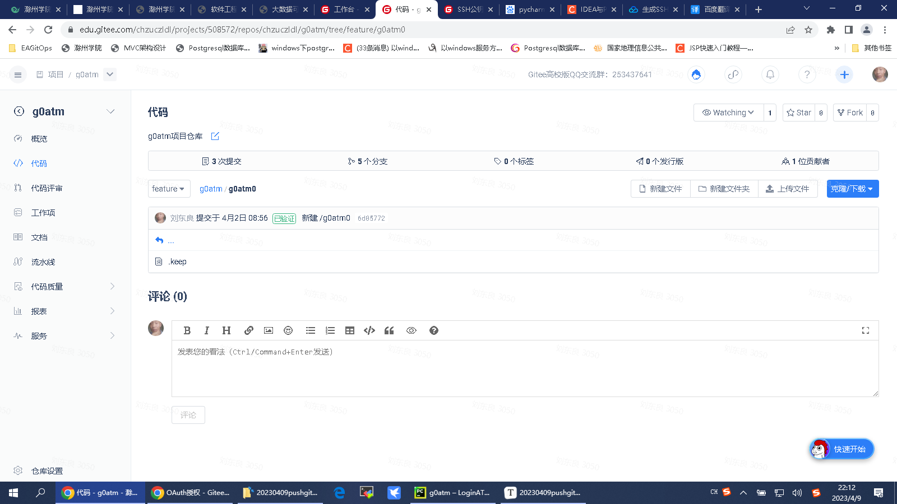

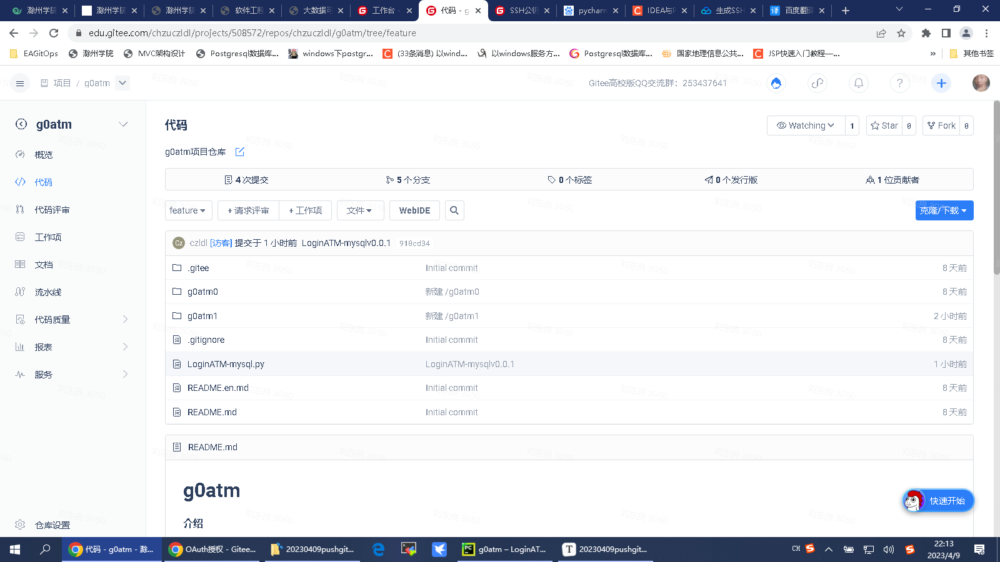

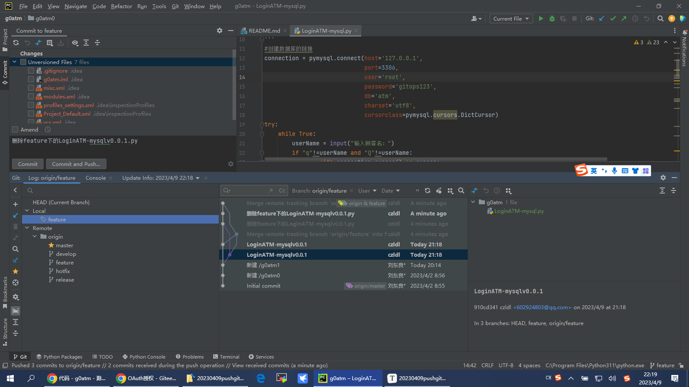

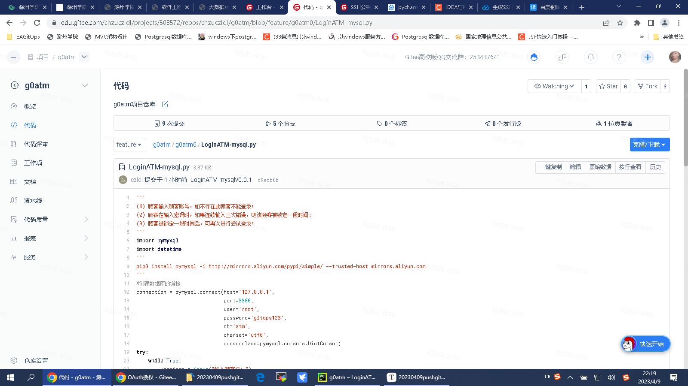

#### SSH免密安全访问

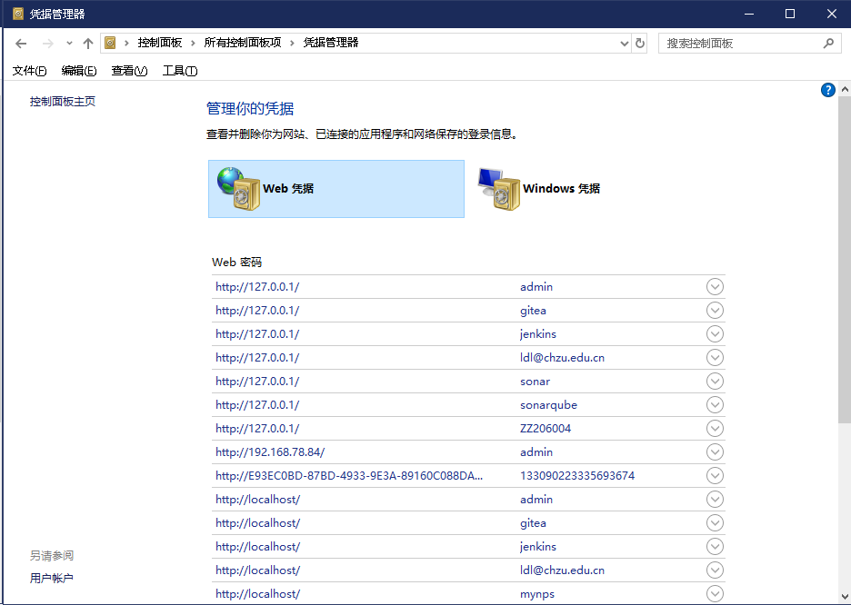

window 用户：dll,目录下.ssh
执行如下命令：

ssh-keygen -t rsa -C "602924803@qq.com"

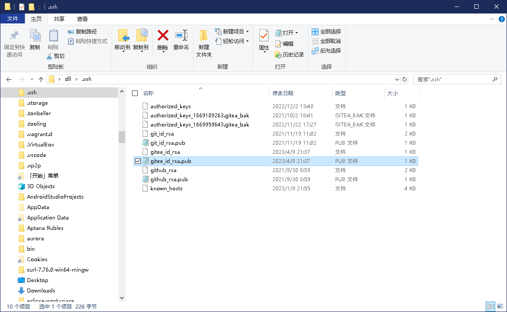

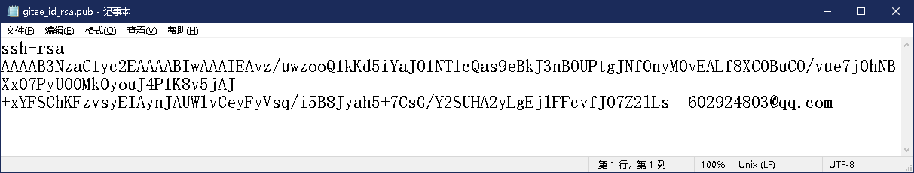

#### 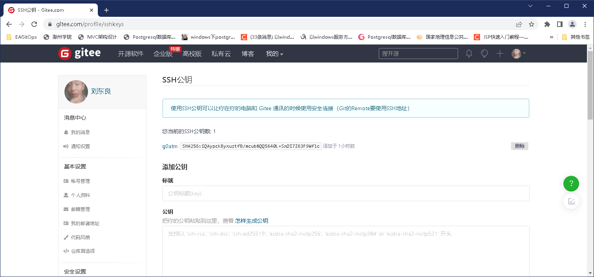Git Bash操作

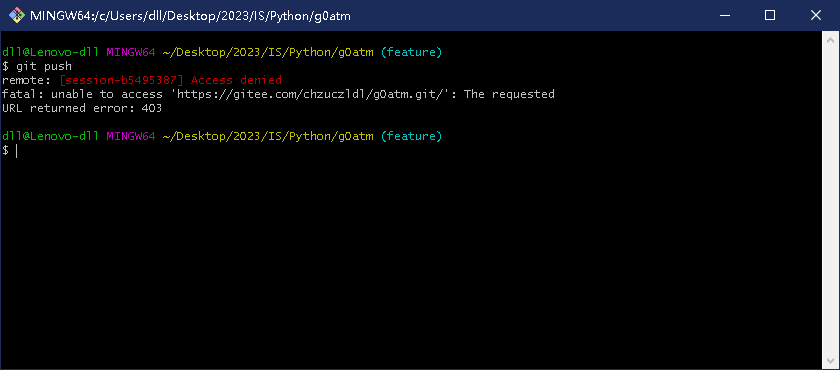

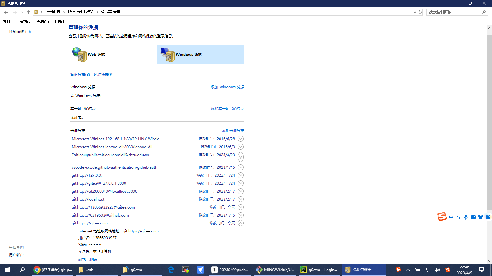

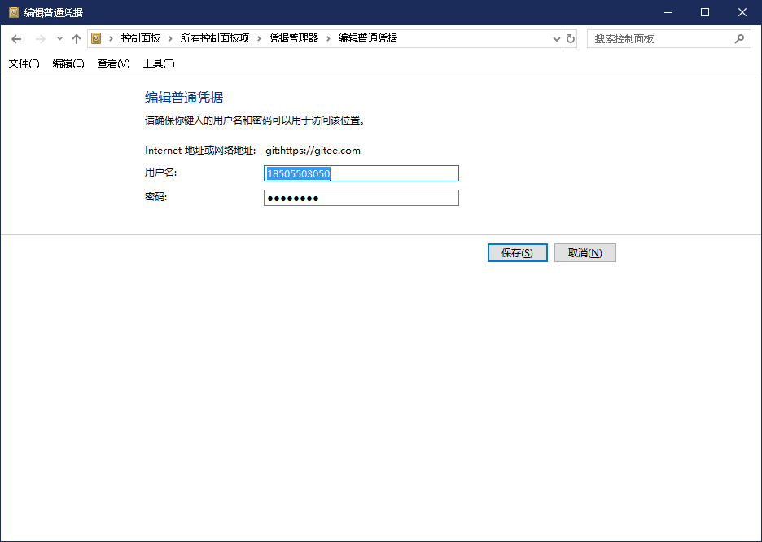

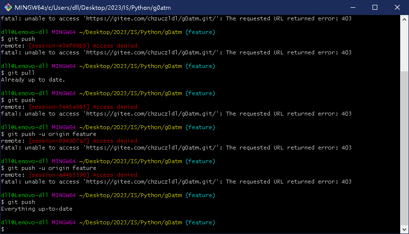

假如没有Gitee多个账号，push不会失败，而是弹出输入账号、密码的对话框。pycharm通过插件可以保存凭据，对于不熟悉的人，会不知道如何操作。

Git bash也失败的原因，基本都是多个账号导致，这个可能window的凭据管理有关。

#### 我的仓库g0atm

参考我的仓库：https://gitee.com/chzuczldl/g0atm.git